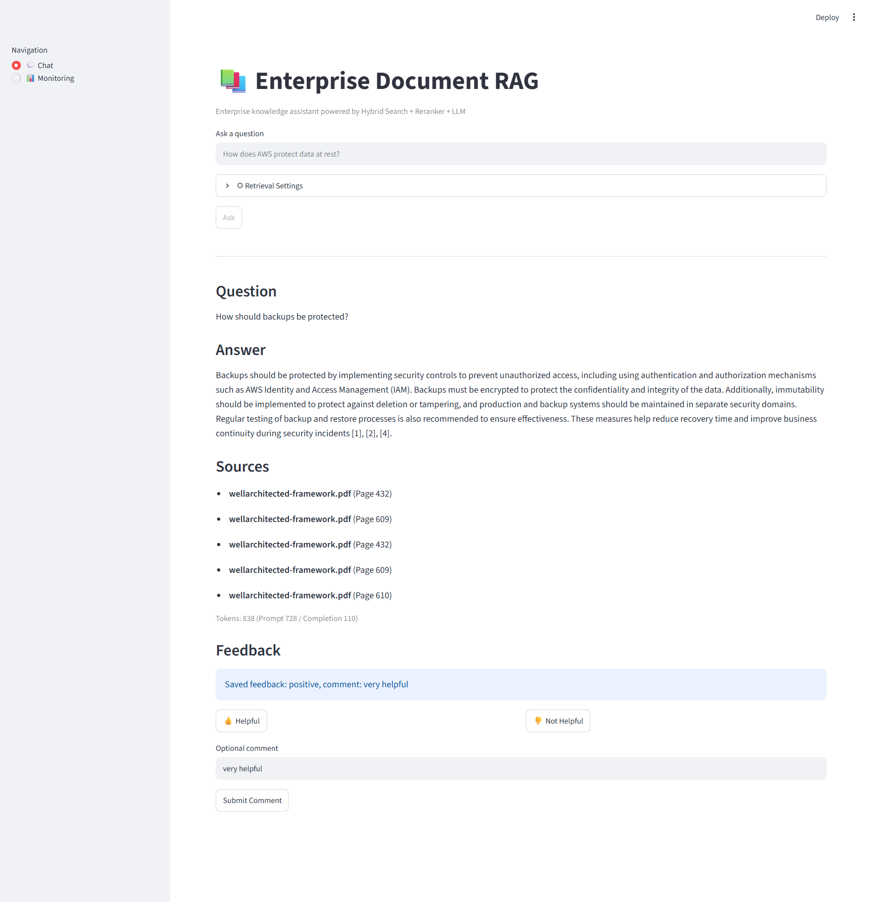
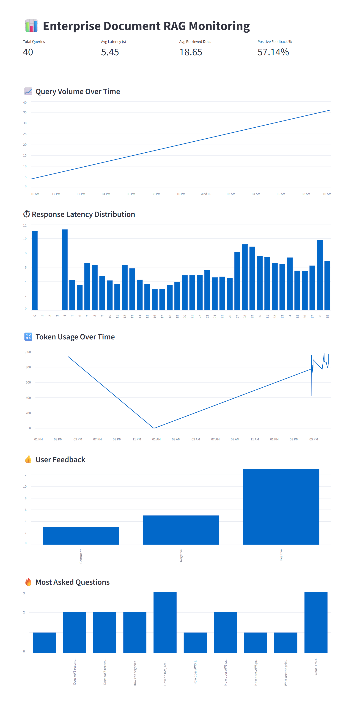
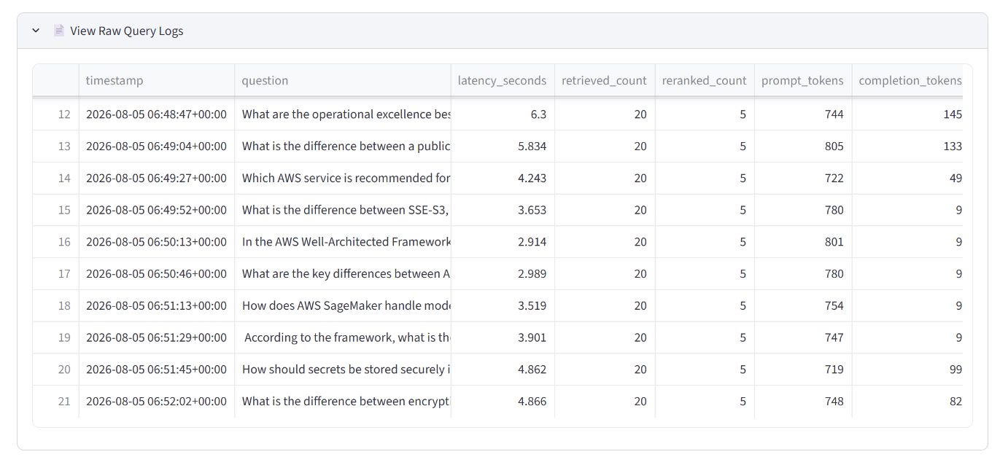
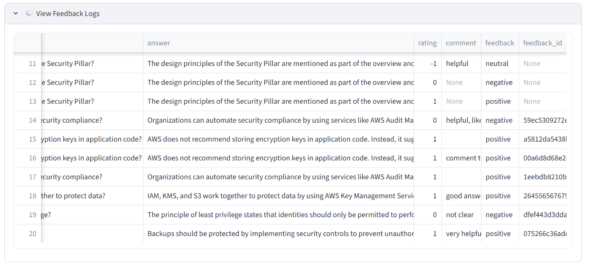

# Enterprise Document RAG

## Problem Statement

Enterprise documents often contain large amounts of unstructured information, making it difficult for users to quickly find accurate answers.

Traditional keyword-based search can miss the semantic meaning behind user questions, while manually reviewing long documents is time-consuming and inefficient.

This project solves this problem by building an AI-powered document question answering system that combines semantic search, keyword retrieval, and reranking to provide accurate, grounded answers with relevant document citations.

## Overview

An enterprise-oriented Retrieval-Augmented Generation (RAG) system for question answering over large document collections.

The system automatically ingests PDF documents, indexes them using both dense vector embeddings and BM25 keyword search, reranks retrieved passages with a Cross-Encoder model, and generates grounded answers using OpenAI GPT models.

It also includes retrieval evaluation, LLM-as-a-Judge evaluation, monitoring dashboards, and user feedback collection.

---

## Architecture

```
                    PDF Documents
                          │
                          ▼
                 Document Ingestion
             (Load → Chunk → Embedding)
                          │
        ┌─────────────────┴─────────────────┐
        ▼                                   ▼
   ChromaDB Vector Store               BM25 Store
        │                                   │
        └──────────── Hybrid Search ────────┘
                      (RRF Fusion)
                          │
                          ▼
                  Cross Encoder Reranker
                          │
                          ▼
                     Prompt Builder
                          │
                          ▼
                   OpenAI Chat Model
                          │
                          ▼
                FastAPI + Streamlit UI
                          │
                          ▼
          Monitoring Dashboard & Feedback
```

---

## Features

- Automated PDF ingestion pipeline
- Recursive document chunking
- Dense vector retrieval using ChromaDB
- BM25 keyword retrieval
- Hybrid retrieval using Reciprocal Rank Fusion (RRF)
- Cross-Encoder reranking
- OpenAI-powered answer generation
- FastAPI REST API
- Streamlit web application
- Retrieval evaluation (Hit Rate, MRR, NDCG)
- LLM-as-a-Judge evaluation
- Query monitoring dashboard
- User feedback collection

---

## Tech Stack

| Category | Technology |
|-----------|------------|
| Language | Python 3.13 |
| LLM | OpenAI GPT-4o |
| Embeddings | OpenAI text-embedding-3-small |
| Vector Database | ChromaDB |
| Keyword Search | BM25 |
| Reranker | BAAI/bge-reranker-base |
| Backend | FastAPI |
| Frontend | Streamlit |
| Monitoring | Streamlit Dashboard |
| Evaluation | Retrieval Metrics + LLM Judge |

---

## Requirements

- Python 3.13+
- OpenAI API Key

---

## Installation

Clone this repository (or download the project), then run:

```bash
cd enterprise-document-rag
```

Install all dependencies:

```bash
uv sync
```

Create a `.env` file in the project root:

```env
OPENAI_API_KEY=your_openai_api_key
```

---

## Prepare Documents

The repository does not include source PDF documents.

Download the AWS Well-Architected Framework PDF from the official AWS documentation:

https://docs.aws.amazon.com/wellarchitected/latest/framework/wellarchitected-framework.pdf

Place the downloaded file at:
```
data/raw/
└── wellarchitected-framework.pdf
```

---

## Ingest Documents

Before starting the application, build the vector database and BM25 index from the source documents.

```bash
uv run python -m scripts.ingest_documents
```

---

## Run with Docker Compose

After creating the `.env` file, build and start the application:

```bash
docker compose up --build
```

This launches:

- FastAPI API: `http://localhost:8000`
- Streamlit UI: `http://localhost:8501`

The Streamlit application communicates with the FastAPI service through the internal Docker network.

---

## Local Development

Run the services locally without Docker Compose.

### Start the FastAPI Backend

```bash
uv run uvicorn src.api.main:app --reload
```

API Endpoint:

```
POST /query
```

Example request:

```json
{
  "question": "How does AWS protect data at rest?",
  "retrieval_k": 20,
  "rerank_k": 5,
  "source_filter": [
    "wellarchitected-framework.pdf"
  ]
}
```

Example response:

```json
{
  "question": "...",
  "answer": "...",
  "sources": [
    {
      "source_file": "wellarchitected-framework.pdf",
      "page": 399
    }
  ]
}
```

### Start the Streamlit Web UI

```bash
uv run streamlit run src/frontend/app.py
```

The Streamlit interface provides:

- Natural language chat
- Source citations
- Retrieval configuration
- User feedback
- Monitoring dashboard

---

## Monitoring

Every query is automatically logged.

Logged metrics include:

- Query timestamp
- Latency
- Retrieval count
- Reranked document count
- Prompt tokens
- Completion tokens
- Total tokens

The dashboard visualizes:

- Total queries
- Average latency
- Retrieved documents
- Token usage
- User feedback
- Most frequently asked questions



---

## Evaluation
```
PDF Documents
      |
      v
generate_ground_truth.py
      |
      v
ground_truth.json/csv
      |
      +----------------+
      |                |
      v                v
Retrieval Evaluation   LLM Evaluation
```
### Ground Truth Generation

Generate evaluation questions from the document collection.

This step creates ground-truth questions used for retrieval and LLM evaluation.

Run:

```bash
uv run python -m scripts.generate_ground_truth
```

### Retrieval Evaluation

Evaluated on **300 test queries** (`k=5`):

#### 1. Accuracy Metrics

| Retrieval Method | Hit Rate@5 | MRR@5 | Precision@5 | Status |
| :--- | :---: | :---: | :---: | :---: |
| Vector Only | 0.8767 | 0.7483 | 0.1753 | |
| Keyword Only | 0.8867 | 0.7707 | 0.1773 | |
| Hybrid (RRF) | 0.9133 | 0.8177 | 0.1827 | |
| **Hybrid + Reranker** | **0.9733** | **0.8948** | **0.1947** | 🏆 **Best Quality** |

#### 2. Latency & Throughput Benchmark

| Retrieval Method | Total Time (300 Qs) | Average Latency | Throughput (QPS) |
| :--- | :---: | :---: | :---: |
| **Keyword Only** | **00:04** | **~13.3 ms** | **65.01 it/s** ⚡ |
| Vector Only | 01:46 | ~353 ms | 2.83 it/s |
| Hybrid (RRF) | 02:01 | ~403 ms | 2.47 it/s |
| Hybrid + Reranker | 12:58 | ~2590 ms | 0.39 it/s (2.59s/it) |

> **Engineering Trade-off Insights:**
> - **`Hybrid + Reranker`** yields the highest accuracy (+6% Hit Rate over Hybrid), but adds ~2.2s latency per query due to cross-encoder reranking overhead.
> - **`Hybrid (RRF)`** offers the optimal balance between response speed (~400ms) and retrieval quality (91.3% Hit Rate) for latency-sensitive applications.

Run:

```bash
uv run python -m scripts.run_retrieval_evaluation
```

---

### LLM Evaluation

Answers are evaluated using GPT-4o-mini as an LLM Judge.

Evaluation dimensions:

- Correctness
- Faithfulness
- Citation Quality
- Helpfulness
- Hallucination

Results on 30 ground-truth questions:
| Config | Correctness | Faithfulness | Hallucination | Citation | Helpfulness | Overall |
| ------- | ----------- | ------------ | ------------- | -------- | ----------- | ------- |
| **basic_k5** | **4.87** | **4.87** | **3.33%** | **4.87** | **4.93** | **4.87** |
| strict_k5 | 4.87 | 4.80 | 6.67% | 4.80 | 4.90 | 4.84 |

>The evaluation selected `basic_k5` as the best-performing configuration with an overall score of 4.87/5.

Run:

```bash
uv run python -m scripts.run_llm_evaluation
```

---

## Design Decisions

### Hybrid Retrieval
Dense retrieval provides semantic understanding while BM25 improves exact keyword matching.
RRF combines both approaches without requiring score normalization.

### Reranking
A Cross Encoder reranker is applied after retrieval because it provides higher accuracy while avoiding the cost of scoring the entire corpus.

### Vector Database
ChromaDB was selected for local development due to simplicity and support for persistent vector storage.

---

## Project Structure

```
src/
├── api/
├── embedding/
├── evaluation/
├── frontend/
├── ingestion/
├── llm/
├── monitoring/
├── rag/
└── retrieval/

scripts/
    generate_ground_truth
    ingest_documents.py
    run_llm_evaluation.py
    run_retrieval_evaluation.py

src/frontend/
    app.py
    dashboard.py
    feedback.py

data/
    raw/
    chroma_db/
    bm25_store/
    logs/
```

---

## Testing

```bash
pytest
```

---

## Future Improvements

- Multi-document upload
- Authentication
- Persistent feedback database
- Grafana monitoring
- LangSmith tracing
- Streaming responses
- Async retrieval pipeline

---

## Productionisation

The current ingestion workflow is implemented as a Python pipeline.
In production, this can be orchestrated using Airflow or Prefect with:

- Scheduled ingestion jobs
- Incremental document processing
- Failure retry
- Data quality checks
- Index refresh management

---

## License

MIT